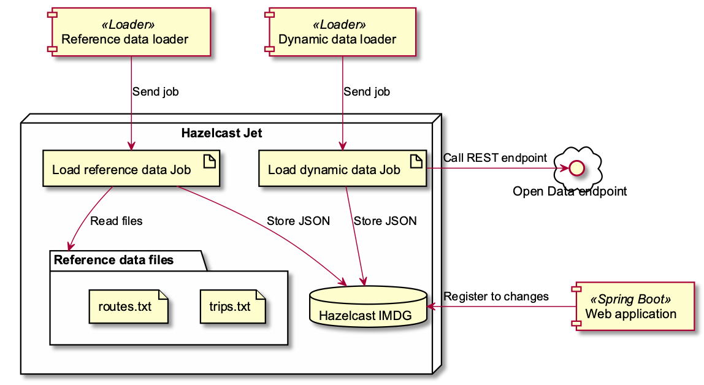

= Jet Trains
Author: <nicolas.frankel@hazelcast.com>
v1.0, 2019-12-17
:icons: font

This project is a demo of https://jet.hazelcast.org/[Hazelcast Jet^], a data streaming engine based on https://hazelcast.org/[Hazelcast IMDG^].

It displays the position of public transports in the Bay Area in near real-time.

NOTE: It used to showcase Switzerland's public transports.
Unfortunately, the Swiss data provider doesn't provide the GTFS-RT feed anymore.

image::https://img.youtube.com/vi/tP1czEIK6OY/sddefault.jpg[Screenshot of the demo,640,480,align=center,title=Demo screenshot (click to watch a recording sample),link=https://www.youtube.com/watch?v=tP1czEIK6OY]

The technology stack consists of:

* https://jet-start.sh/[Hazelcast Jet^]
* https://hazelcast.org/imdg/[Hazelcast IMDG^]
* https://kotlinlang.org/[Kotlin^] for the code
* https://spring.io/projects/spring-boot[Spring Boot^] for the webapp
* https://maven.apache.org/[Maven^] for the build system

== Overall structure

The project contains several modules with dedicated responsibilities:

[options="header,autowidth"]
|===

| Name | Description

| `common`
| Code shared across modules

| `infrastructure`
| Contain the static data files, as well as configuration files for Docker Compose and Kubernetes

| `local-jet`
| As an alternative to the previous module, start a local Jet instance to be able to debug inside the IDE

| `load-static`
| Load GTFS-RT static data from files in memory.
Those files contain reference data that are used later to enrich the data pipeline

| `stream-dynamic`
| Call an OpenData endpoint to get dynamic data, transform it, enrich it, and store it into an IMDG map

| `web`
| Subscribe to the aforementioned IMDG map and publish changes to a web-socket endpoint.
The UI subscribes to the endpoint and displays each data point on an Open Street Map.

|===

== Reference documentation

The data provider releases data compliant with the https://developers.google.com/transit[General Transport Feed Specification^] (by Google).

Two types of data are available:

. https://developers.google.com/transit/gtfs[Static files^] that contain reference data that don't change often _e.g._ schedules, stops, etc.
. A REST endpoint serves https://developers.google.com/transit/gtfs-realtime[dynamic data^] _e.g._ vehicle positions

== Running the demo: data

The demo is based on data provided by https://511.org/open-data[511 SF Bay’s Open Data Portal^].

=== Data update

Every day, new reference data (_e.g._ expected stop times) are published.
Hence, the infrastructure project that contains said data needs to be updated with new files.
Note that only 4 files are required for the demo: `agency.txt`, `routes.txt`, `stops.txt` and `trips.txt`.

[quote,https://511.org/open-data/transit]
____
GTFS Feed Download allows the user to download a zip file containing GTFS dataset for the specified operator/agency.
It also contains additional files, called the GTFS+ files, that provide information not contained in the GTFS files such as the direction names, fare zone names, etc.

*Endpoint*: \http://api.511.org/transit/datafeeds?api_key=[your_key]&operator_id=RG

*Allowable parameters*: `api_key` (mandatory), `operator_id` (mandatory), and `historic` (optional)
____

=== API Key

Calling the endpoint requires an API key.

. First, https://511.org/open-data/token[register^]
. You'll receive a confirmation email
. When you've confirmed the email, you'll receive a new email with the token
. The token should be used as an argument when launching the `com.hazelcast.jettrain.data.MainKt` class from the `stream-dynamic` module:
+
[source,bash]
java com.hazelcast.jettrain.data.MainKt $TOKEN

NOTE: There's a rate limiter on the server side:
the endpoint returns a 429 status if it's queried more than 60 times per hour.
In order to not go over this limit too soon, the Jet job is configured to run only once per 31 seconds.

== Running the demo: developer setup

If you're a Java developer, this approach will be fastest as you probably have all the tools ready.

=== Requirements

* Git (with LFS extension installed - on Ubuntu it's not installed by default) 
* A Java IDE _e.g._ IntelliJ IDEA, Eclipse, etc.

=== Steps

. Clone the repo
. Import the code into your IDE
. In the `local-jet` module, run the `com.hazelcast.jettrain.LocalJet.kt` class inside the IDE with the following parameters:
+
[source,bash]
----
-Xmx8g \                                                             <1>
-XX:+UseStringDeduplication \                                        <2>
--add-modules java.se \                                              <3>
--add-exports java.base/jdk.internal.ref=ALL-UNNAMED \               <3>
--add-opens java.base/java.lang=ALL-UNNAMED \                        <3>
--add-opens java.base/java.nio=ALL-UNNAMED \                         <3>
--add-opens java.base/sun.nio.ch=ALL-UNNAMED \                       <3>
--add-opens java.management/sun.management=ALL-UNNAMED \             <3>
--add-opens jdk.management/com.sun.management.internal=ALL-UNNAMED   <3>
----
+
<1> Reserve extra memory
<2> Improve memory efficiency when storing strings
<3> Necessary when working with Java 9+
+
. To import static data files, run the `MainKt` class from inside the `load-static` module:
+
[source,bash]
java -Ddata.path=/path/to/local/infrastructure/data com.hazelcast.jettrain.refs.MainKt
+
. To query dynamic data, run the `MainKt` class from inside the `stream-dynamic` module:
+
[source,bash]
java -Dtoken=$YOUR_511_TOKEN com.hazelcast.jettrain.data.MainKt
+
In the `web` module:
+
[source,bash]
java com.hazelcast.jettrain.JetDemoKt
+
The webapp is available at http://localhost:8080.

== Running the demo: Docker-Compose

With this setup, you'll build the demo from source.

=== Requirements

* Docker compose
* Hazelcast Jet distribution

=== Steps

. Start Docker
. Get the webapp image:
+
[source,bash]
----
docker pull nfrankel/jettrain:latest
----
+
. Adapt the `docker-compose.yml` file to your file hierarchy.
I found no way to use relative files path in Docker Compose (hints/PRs welcome).
You need to update the file to use the correct paths.
Look for paths starting with `/Users/nico/projects/hazelcast/` and update accordingly.
+
. Start the containers:
In the `infrastructure/compose` folder :
+
[source,bash]
----
docker-compose up
----
+
. Get the https://github.com/hazelcast/jet-train/releases/download/1.0-SNAPSHOT/load-static-1.0-SNAPSHOT.jar[latest "static" JAR^]
. Configure the client configuration file.
+
It depends on the topology.
Here's a sample:
+
[source,yaml]
.$JET_DISTRIBUTION/config/jettrain.yml
----
hazelcast-client:
  cluster-name: jet
  network:
    cluster-members:
      - localhost:31781
    smart-routing: false
  connection-strategy:
    connection-retry:
      cluster-connect-timeout-millis: 1000
----
+
. To load static data:
+
In the Hazelcast Jet distribution folder, run the following commands:
+
[source,bash]
----
./jet --config ../config/jettrain.yml submit -v -c com.hazelcast.jettrain.refs.Agencies $PROJECT_ROOT/load-static/target/load-static-1.0-SNAPSHOT.jar
./jet --config ../config/jettrain.yml submit -v -c com.hazelcast.jettrain.refs.Stops $PROJECT_ROOT/load-static/target/load-static-1.0-SNAPSHOT.jar
./jet --config ../config/jettrain.yml submit -v -c com.hazelcast.jettrain.refs.Routes $PROJECT_ROOT/load-static/target/load-static-1.0-SNAPSHOT.jar
./jet --config ../config/jettrain.yml submit -v -c com.hazelcast.jettrain.refs.Trips $PROJECT_ROOT/load-static/target/load-static-1.0-SNAPSHOT.jar
./jet --config ../config/jettrain.yml submit -v -c com.hazelcast.jettrain.refs.StopTimes $PROJECT_ROOT/load-static/target/load-static-1.0-SNAPSHOT.jar
----
+
. Get the https://github.com/hazelcast/jet-train/releases/download/1.0-SNAPSHOT/stream-dynamic-1.0-SNAPSHOT.jar[latest "dynamic" JAR^]
. To query dynamic data:
+
In the Hazelcast Jet distribution folder, run the following command:
+
[source,bash]
./jet --config ../config/jettrain.yml submit -n Stream -v -c com.hazelcast.jettrain.data.SubmitKt $PROJECT_ROOT/stream-dynamic/target/stream-dynamic-1.0-SNAPSHOT.jar $TOKEN
+
.The map is available at <http://localhost:8080/>
